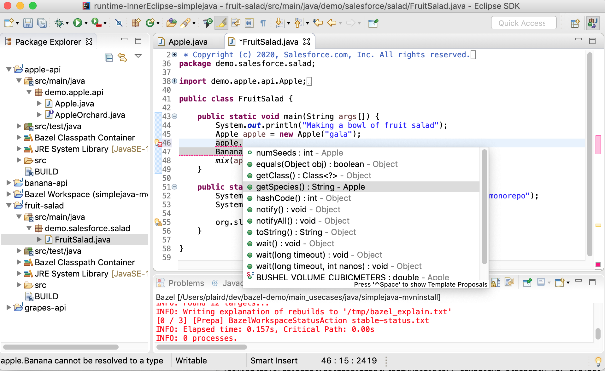

## Bazel Eclipse Feature 

## Using the Bazel Eclipse Feature

**Quick Installation**

Drag the _Install_ button and drop on your running Eclipse IDE and search for _Bazel_.
It is that easy!

BEF is supported on Linux and Macos, and has [conditional Windows support](windows.md).

**Detailed Installation and User's Guides**

For detailed manual installation and setup instructions, and the User's Guide, see these pages:

- [Installing Eclipse and the Bazel Eclipse Feature](install.md)
- [Bazel Eclipse Feature User's Guide](using_the_feature.md)

## BEF Status and Roadmap

Development of this feature is currently being done as a side project by a team within Salesforce.
You can track our past/current/future work using these links:

- [BEF project management](https://github.com/salesforce/bazel-eclipse/projects)

Current development is dedicated to Bazel workspaces with Java rules.
The **1.x** release line is focused on:
- Basic features of Java editing (code completion, incremental compilation, launching programs, debugging, etc)
- Correctness of the Bazel-derived classpath
- Scalability and performance
- Gradually reducing [certain package file layout restrictions](conforming_java_packages.md).

The **2.x** release line will work towards adding Bazel specific features to Eclipse:
- BUILD file editor
- Automatic dependency management
- Support for more complex Java package layouts

Support for languages other than Java will likely not appear prior to 3.x.

To find planned features, known technical debt and known bugs that need work, please look at:

- [BEF project management](https://github.com/salesforce/bazel-eclipse/projects)
- [Bazel Java SDK project management](https://github.com/salesforce/bazel-java-sdk/issues)
- _TODO_ comments in the code base; smaller ideas are tracked using simple _TODO_ comments

## History and Credit

Full history and credit is explained in the [history and credit document](history.md).

## Developing BEF

For developers that want to contribute to BEF:
- [BEF Dev Guide](../dev/dev_guide.md) (if you would like to build/modify the BEF)
