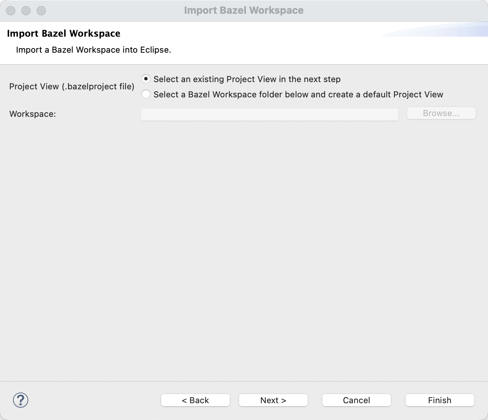
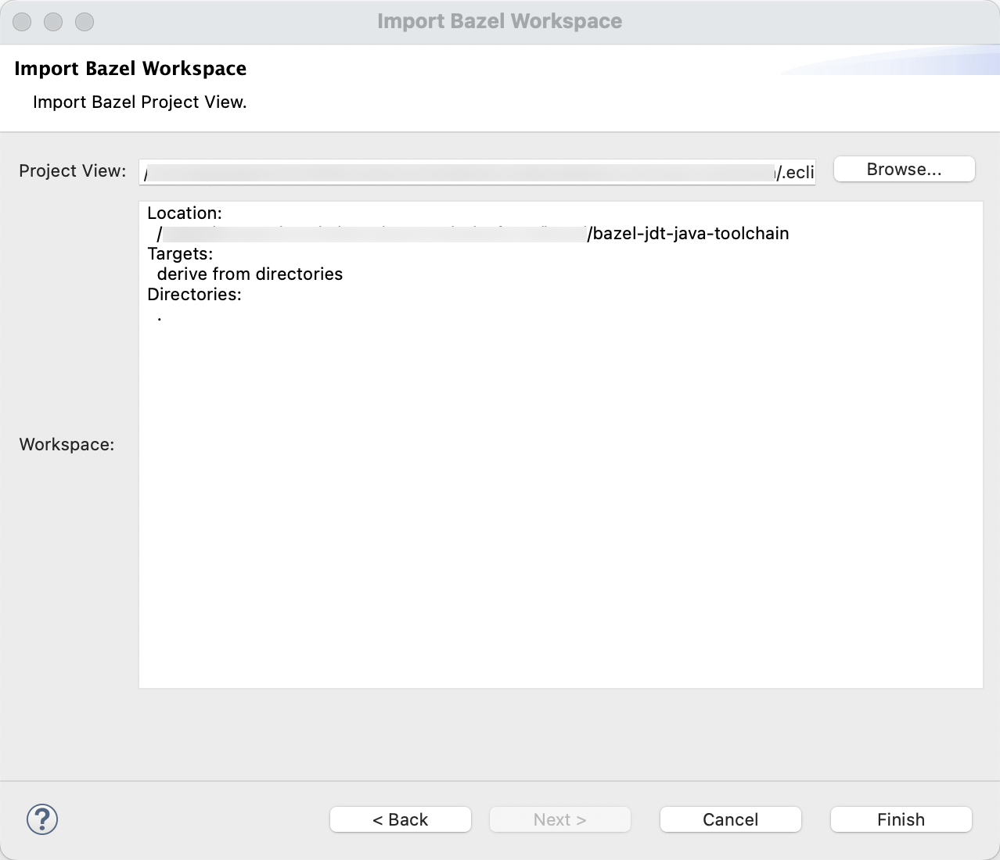

## Importing a Bazel Workspace 

To work on your Bazel Workspace you must first import it.


### Prerequisite: Project Views

The import if focused around project views.
Project views is a concept introduced by the IntelliJ Bazel plug-in.
A default one will be created if you don't have one yet.

Please read [all about Project Views and how they work](../common/projectviews.md) to understand how projects are created in Eclipse.


### Prerequisite: Build

Before you import a Bazel Workspace, you **should** run a command line build of the full workspace.
The import will likely fail if there are build errors in the workspace because import uses metadata computed from the `BUILD` files.
Some problems are tolerated (eg., compile issues in leaf targets) but errors in `BUILD` files will almost certainly break the import.

```
# recommended (but not required)
bazel build //...
```


### Steps to Import

In Eclipse do the following

- Got to *File > Import... > Bazel > Import Bazel Workspace* and click *Next*
- Choose either *Select an existing Project View* or *Select a Bazel Workspace folder*



**Select an existing Project View**

Use this if you have a specific `.bazelproject` file you want to import.
This will ensure the workspace is imported using a `.bazelproject` file selected in the next step.

**Select a Bazel Workspace folder**

Use this if you don't have `.bazelproject` file.
A default one will be created in the next step.

Note, After selecting this option you have to click *Browse...* and select the folder.

**What if I already have a `.eclipse/.bazelproject` file?**

Use *Select a Bazel Workspace folder* in this case.
It will be discovered and re-used.

- After clicking *Next* you will be able to select a `.bazelproject` file and review the selected file.



- Click *Finish* to start the import.

The import may take a while.
The plug-in will execute a couple of Bazel queries and builds to compute all required information.


### Next Topic: Sync & Build

The next page in our guide discusses [Sync & Build](sync_and_build.md) of the Bazel Eclipse Feature.
