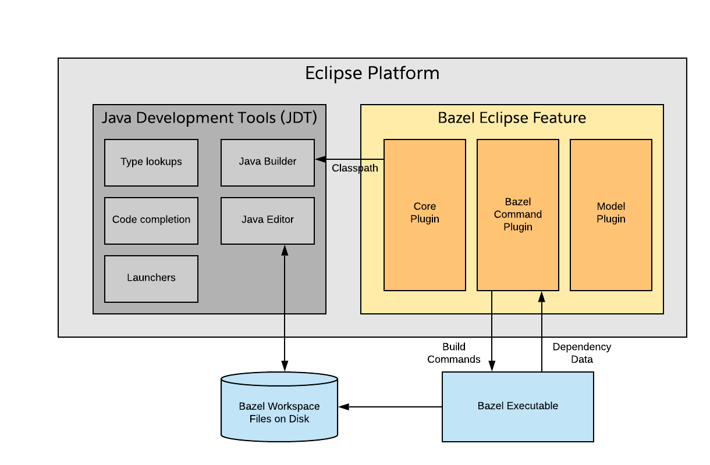

## Bazel Eclipse Feature Architecture

### It's a Feature not a Plugin

In the Eclipse world, a *plugin* is a low level artifact roughly equivalent to a *jar* in the Maven world.
Just like you rarely think of jars as applications, an Eclipse plugin is not normally a self-standing piece of functionality.

Eclipse plugins are typically collected into a *feature*, and distributed as a monolithic component.
As such, what this repository builds is the Bazel Eclipse **Feature**, not the Bazel Eclipse **Plugin**.

### Eclipse Features are Installation Scoped

This seems obvious, but when troubleshooting installations it is nice to have confirmation.

```
Feature installations are done into an Eclipse installation, not into a workspace.
```

You may have multiple Eclipse workspaces associated with a single Eclipse installation, but nothing about the install is workspace scoped.

### Concept Mappings

It is useful to explain how terminology maps between the Bazel and Eclipse worlds when using the Bazel Eclipse Feature.

- A single Bazel **workspace** can be imported into an Eclipse **workspace**
- Each imported Bazel **package** is imported as an Eclipse **project**

Consult the feature roadmap for questions about support for nested Bazel workspaces, external Bazel repositories,
  non-Java packages, etc.

### How the Bazel Eclipse feature fits in with JDT

:point_right: note that this section is written as the feature currently exists, which is a Java-only
Eclipse build feature. When we move to support other languages, this section will need heavy modification.

The Eclipse [JDT](https://www.eclipse.org/jdt/) (Java Developer Tools) are the set of components that run inside of
  Eclipse to support Java development, regardless of the build technology (Maven, Ant, Bazel).
The JDT components fulfill features such as:

- Syntax highlighting
- Code completion
- Incremental code compilation
- Search
- Debugger support
- Code formatters

But to do this, the JDT components need to be provided:

- Locations of Java source files
- Classpath of each set of source files
- Target JDKs and other environment config

For this, they rely on build-specific features/plugins like this Bazel Eclipse feature and [M2Eclipse](http://www.eclipse.org/m2e/).
The Bazel Eclipse Feature sits alongside the JDT componentns in Eclipse to be the bridge between
  Bazel Java projects and the JDT.
It hooks into Bazel to compute classpaths and find Java source files.




### Invokes command line Bazel to perform the build

When a user saves a file, the Bazel Eclipse Feature has a hook into Eclipse to be notified.
When notified, the feature delegates the build operation to command line Bazel.
It actually constructs a Bazel command line pattern, and invokes it in a shell.
The output streams back to the Console view.

Because it does the build in this way, it honors your *.bazelrc* file and other local config.

### Uses Bazel Aspects to introspect topology

The feature has to compute classpath information for the Bazel targets.
It does this so that JDT can know what classes are available for code completion, and the incremental
  compiler can flag issues with red squigglies.
One way to do this in Bazel is to use Bazel Query, which is a tool that is included in Bazel.
This tools is handy for ad-hoc queries from the command line.

But this feature doesn't use Bazel Query, it uses [Aspects](https://docs.bazel.build/versions/master/skylark/aspects.html).
The feature injects Aspects into the dependency graph to output classpath information for each Bazel
  target into .json files.
Those .json files are written into their package location in *bazel-bin* directory.
The feature then reads those files to compute classpath information, which gets written into the Bazel Classpath Container.

### Bazel Classpath Container

The bridge between JDT and the Bazel Eclipse Feature is largely accomplished by the Bazel Classpath container.
You can see it in action by visiting the *Java Build Path* properties for each imported package.
The *Libraries* tab will show an entry called *Bazel Classpath Container* on the classpath of the Eclipse project.
Inside of that is a dynamic list of dependencies that are used by the targets in the workspace.

### Bazel Java SDK

Most of the code used by BEF is actually sourced from a companion top-level project -
  the [Bazel Java SDK](bazeljavasdk.md).
Before doing any work on BEF, it is important to understand what the SDK is, how it is
  incorporated in to BEF, and design tenets of the SDK.

### What does Maven do?

It makes sense to look over the fence at the Maven plugins to see how they have implemented the same
  functionality.

- [M2Eclipse plugins](https://github.com/eclipse-m2e/m2e-core)

### The plugins that compose the Bazel Eclipse Feature

Internally, the Bazel Eclipse Feature is implemented using several Eclipse plugins.
Not only does this separate concerns, but it makes unit testing simpler.
Only one plugin (the *plugin-core*) has access to Eclipse APIs.

- **com.salesforce.bazel.eclipse.core**: this plugin is the one that is integrated with Eclipse APIs, and contains classes such as the activator
- **com.salesforce.bazel-java-sdk**: handles model abstractions and command execution for Bazel. This is a vendored copy of the [Bazel Java SDK](https://github.com/salesforce/bazel-java-sdk) which is a general purpose SDK for Bazel.
